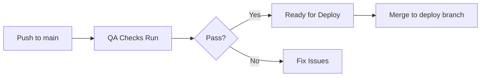

# GitHub Actions Workflow Pipeline

## Overview

This project uses a **branch-based deployment strategy** with separate development and production environments:

- **`main` branch** - Active development with automated QA checks
- **`deploy` branch** - Production deployments only

### Deployment Pipeline

When code is pushed or merged to the `deploy` branch:

```
QA Checks → Pre-Deploy Check → Deploy to GitHub Pages
```

This ensures only tested, production-ready code reaches the live site.

## Workflow Files

### 1. 🚀 Production Deploy Pipeline (`main-deploy-pipeline.yml`)
**Production orchestrator workflow** that chains all workflows for deployment.

**Triggers:**
- Push to `deploy` branch only (production)
- Manual trigger via GitHub Actions tab

**Flow:**
1. **QA Checks** - Runs comprehensive quality tests
2. **Pre-Deploy Check** - Validates deployment readiness
3. **Deploy** - Deploys to GitHub Pages using Jekyll

**⚠️ Important:** This only runs on the `deploy` branch to keep production separate from development.

### 2. 🧪 QA Automation (`qa-checks.yml`)
**Comprehensive quality assurance testing** across all pages.

**Includes:**
- HTML5 validation
- Broken link checking
- Lighthouse performance & accessibility tests
- End-to-end Playwright tests
`develop`, or `deploy` branches
- Pull requests to `main`, `master`, or `deploy`
- Manual trigger
- Called by productio to `main` or `master`
- Manual trigger
- Called by main pipeline

### 3. 🔍 Pre-Deploy Check (`pre-deploy-check.yml`)
**Final validation before deployment** with quick checks and optional full suite.

**Includes:**
- Quick quality check (critical tests only)
- HTML validation
- Broken link check
- Full test suite (on PRs)

**Triggers:**
- Pull requests to `main`, `master`, or `deploy`
- Push to `develop` or `staging`
- Called by production pipeline

### 4. 📦 Jekyll GitHub Pages (`jekyll-gh-pages.yml`)
**Build and deploy** the site to GitHub Pages using Jekyll.

**Includes:**
- Jekyll build process
- GitHub Pages deployment

**Triggers:**
- Push to `deploy` branch only
- Manual trigger
- Called by production pipeline

## How It Works

### Development Workflow (main branch)



### Production Deployment (deploy branch)

```mermaid
grapCreating the Deploy Branch

If the `deploy` branch doesn't exist yet:

```bash
# From main branch, create and push deploy branch
git checkout main
git pull origin main
git checkout -b deploy
git push -u origin deploy
```

### Manual Deployment

You can manually trigger the pipeline from the GitHub Actions tab:
1. Go to **Actions** → **Production Deploy Pipeline**
2. Click **Run workflow**
3. Select `deploy` F{Pass?}
    F -->|Yes| G[Deploy to GitHub Pages]
    F -->|No| E
   Deployment Process

### Step-by-Step Guide

1. **Develop on main:**
   ```bash
   git checkout main
   # Make your changes
   git add .
   git commit -m "Your changes"
   git push origin main
   ```
   QA checks run automatically, but no deployment happens.

2. **Test locally:**
   ```bash
   npm test
   npm run server
   ```

3. **Ready to deploy?** Merge to deploy branch:
   ```bash
   git checkout deploy
   git merge main
   git push origin deploy
   ```
   This triggers the full deployment pipeline.

## Local Testing

Before pushing to any branch
### Branch Strategy

1. **Development on `main`:**
   - Push changes to `main` branch
   - QA checks run automatically
   - Iterate until all tests pass
   - **No deployment triggered**

2. **Deploy to Production:**
   - Create PR from `main` to `deploy`
   - Review changes
   - Merge to `deploy` branch
   - **Automatic deployment pipeline starts**

### Manual Deployment

You can manually trigger the pipeline from the GitHub Actions tab:
1. Go to **Actions** → **Main Deploy Pipeline**
2. Click **Run workflow**
3. Select branch and confirm

### Individual Workflow Testing

Each workflow can also be run independently:
- **QA Checks** - Run tests without deployment
- **Pre-Deploy Check** - Validate before merging
- **Jekyll Deploy** - Deploy directly (use with caution)

## Workflow Status

The workflows will only proceed if all previous steps pass:
- ✅ All tests pass → Continue to next step
- ❌ Any test fails → Stop pipeline, prevent deployment

## Local Testing

Before pushing to main, run tests locally:

```bash
# Run all tests
npm test

# Run specific test suites
npm run test:accessibility
npm run test:mobile
npm run test:common

# Validate HTML
npm rNever push directly to `deploy`** - Always merge from `main`
2. **Always test locally** before pushing to `main`
3. **Use pull requests** from `main` to `deploy` for production releases
4. **Review all QA checks** before merging to `deploy`
5. **Keep tests updated** as features change
6. **Monitor deployment logs** in GitHub Actions
7. Branch Protection (Recommended)

Configure branch protection rules in GitHub:

### For `deploy` branch:
- ✅ Require pull request reviews before merging
- ✅ Require status checks to pass (QA Checks, Pre-Deploy)
- ✅ Require branches to be up to date before merging
- ✅ Include administrators (enforce for all)

### For `main` branch:
- ✅ Require status checks to pass (QA Checks)
- ⚪ Optional: Require pull request reviews

## Files Overview

- ✅ `.github/workflows/main-deploy-pipeline.yml` - Production orchestrator (deploy branch)
- ✅ `.github/workflows/qa-checks.yml` - Runs on main, develop, and deploy
- ✅ `.github/workflows/pre-deploy-check.yml` - Pre-deployment validation
- ✅ `.github/workflows/jekyll-gh-pages.yml` - GitHub Pages deployment (deploy branch only)

## Quick Reference

| Branch | Purpose | Auto-Deploy | QA Checks |
|--------|---------|-------------|-----------|
| `main` | Development | ❌ No | ✅ Yes |
| `develop` | Feature development | ❌ No | ✅ Yes |
| `deploy` | Production | ✅ Yes | ✅ Yes |
## Permissions

The main pipeline requires these GitHub token permissions:
- `contents: read` - Read repository content
- `pages: write` - Deploy to GitHub Pages
- `id-token: write` - Required for Pages deployment
- `issues: write` - Comment on issues
- `pull-requests: write` - Comment on PRs

## Concurrency

Only one deployment can run at a time to prevent conflicts:
- Concurrent deployments are queued
- In-progress deployments are not cancelled

## Troubleshooting

### Workflow fails at QA Checks
- Review Playwright test results
- Check HTML validation errors
- Fix broken links

### Workflow fails at Pre-Deploy Check
- Review critical test failures
- Ensure all required files exist
- Validate HTML structure

### Workflow fails at Deploy
- Check GitHub Pages settings
- Verify branch permissions
- Review Jekyll build logs

## Best Practices

1. **Always test locally** before pushing to main
2. **Use pull requests** to trigger pre-deploy checks
3. **Review workflow logs** if deployment fails
4. **Keep tests updated** as features change
5. **Monitor performance** via Lighthouse reports

## Files Modified

- ✅ `.github/workflows/main-deploy-pipeline.yml` - New orchestrator workflow
- ✅ `.github/workflows/qa-checks.yml` - Added `workflow_call` trigger
- ✅ `.github/workflows/pre-deploy-check.yml` - Added `workflow_call` trigger
- ✅ `.github/workflows/jekyll-gh-pages.yml` - Added `workflow_call` trigger

---

**Last Updated:** January 2026  
**Maintained by:** AMD WTS-WWG Team
